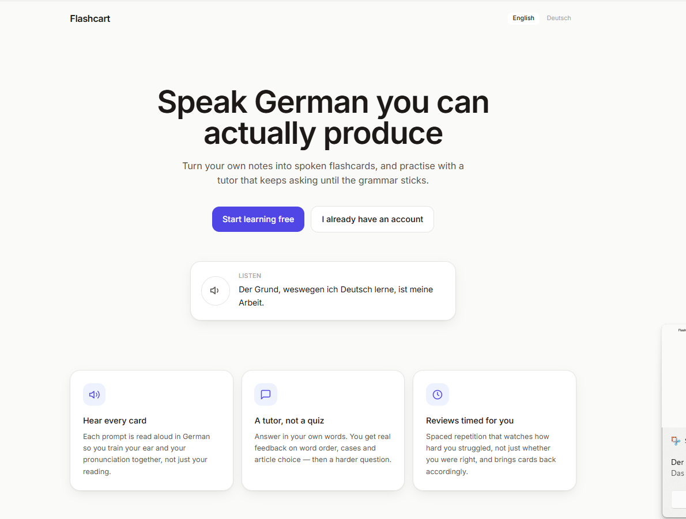
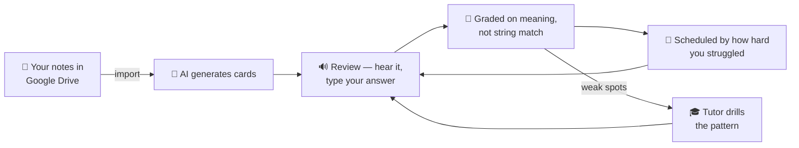

<div align="center">

# 🇩🇪 Flashcart

### Speak German you can actually produce.

Flashcart turns **your own notes** into spoken flashcards and drills you with an AI tutor
that keeps asking until the grammar sticks — not until you *recognise* the answer,
but until you can **produce it yourself**.

<br>



<br>

[](https://nextjs.org)
[](https://www.typescriptlang.org)
[](https://fastapi.tiangolo.com)
[](https://www.prisma.io)
[](#-setup)

**[Getting started](#-using-flashcart)** · **[Setup](#-setup)** · **[Docs](#-documentation)**

</div>

---

## ✨ What makes it different

|  | | |
| :-- | :-- | :-- |
| 🔊 | **Every card is spoken** | Hear each prompt in German — train your ear and pronunciation, not just your reading |
| 📓 | **Your notes, your deck** | Pick a document from your Google Drive and your own notes become flashcards. No authoring session, no generic deck |
| 💬 | **A tutor, not a quiz** | Answer in free text. Get real feedback on word order, cases and articles — then a harder question |
| 📈 | **Reviews timed for you** | Spaced repetition that watches *how hard you struggled*, not just whether you were right |
| 🔒 | **Private by design** | Every deck belongs to one account. Your notes and your mistakes stay yours |
| 🌍 | **English or German UI** | Switchable any time. Card content always stays German |
| 📱 | **Built for your phone** | Responsive, installable, dark mode included |

> [!TIP]
> **Just want to use it?** → [Using Flashcart](#-using-flashcart)
> **Running it yourself?** → [Setup](#-setup)

## 📖 Contents

- [Using Flashcart](#-using-flashcart) — the user guide, no terminal required
- [How it works](#-how-it-works) — the loop in one diagram
- [Stack](#-stack) · [Project layout](#-project-layout)
- [Setup](#-setup) — run it locally, step by step
- [Deploying](#-deploying)
- [Documentation](#-documentation) — architecture, decisions, product requirements

## 🎯 How it works



## 🚀 Using Flashcart

This section is for whoever is *learning* with Flashcart. Nothing here needs a
terminal.

### 1. Create your account

Open the app and choose **Sign up**. You can register with an email and password, or
use **Continue with Google** if the deployment has Google sign-in enabled.

The moment you sign in for the first time, Flashcart copies a **starter German deck**
into your account, so there is something to review before you have connected anything.
Those cards are now yours — edit or delete them freely, it affects nobody else. Every
deck in Flashcart is private to one account.

If you registered with email and password and later forget it, use **Forgot password**
on the sign-in page. You will get a link that is valid for one hour and works once.
(Accounts created through Google have no password to reset — sign in with Google
instead; the app tells you so rather than silently sending nothing.)

### 2. Review your due cards — `/review`

**Review** is the core loop, and it is where most of your time goes.

1. A card appears — a fill-in-the-blank, a "build a sentence with this pattern"
   prompt, a grammar question, or a sentence to correct.
2. Press ▶︎ to **hear it in German**. You can replay as often as you like, and turn
   on auto-play in Settings if you want every card spoken automatically.
3. **Type your answer in your own words.** This is not multiple choice and it is not
   string matching — German allows real variation, and the tutor grades meaning and
   grammar, not characters.
4. You get back a verdict — **correct, partly correct, or incorrect** — plus feedback
   explaining *what* was wrong: word order, the wrong case, a missing article. Wrong
   answers are tagged by mistake type so patterns show up later on your dashboard.
5. Flashcart then schedules when that card comes back.

**When cards come back.** Flashcart uses a five-box Leitner system: get a card right
and it moves up a box and waits longer (roughly 4 hours → 1 day → 3 days → 1 week →
3 weeks); get it wrong and it drops back to box 1 and returns the same day. A partly
correct answer holds its place.

On top of that, the tutor rates how *hard* the answer looked. A card you technically
got right but visibly struggled with comes back sooner than one you nailed — up to
about 60% sooner within the same box. So the queue tracks how solid you actually are,
not just your last yes/no.

When nothing is due, you are done for now. That is the intended feeling — Flashcart
does not manufacture busywork.

### 3. Drill a grammar pattern — `/tutor`

**Review** covers your whole deck. **Tutor** goes deep on one thing.

Pick a topic — a grammar pattern pulled from your notes, shown with your current
mastery — and the tutor starts a conversation: it asks, you answer in free text, it
corrects you and asks again, adjusting difficulty as it goes. It only declares a
pattern **mastered** after several correct productions in a row that it did not have
to prompt you through, so mastery means you can produce the form, not that you
recognised it once.

Sessions are saved, so you can leave and come back.

### 4. Watch your progress — `/dashboard`

The dashboard shows how many cards sit in each Leitner box, your overall mastery
percentage, your accuracy, your review streak, and a panel of **recent mistakes**
grouped by error type. That last one is the useful one: if "case declension" keeps
appearing, that is your next tutor session.

### 5. Bring in your own notes — Settings → Your notes

The starter deck gets you going; your own notes are the point.

1. Go to **Settings → Your notes → Choose from Drive**.
2. Pick the document your German notes live in. Search by name if it is not recent.
3. Press **Import**.

There is no connection step. Signing in with Google already granted Flashcard
read-only access to your Drive, so the picker works the moment you get there.
Flashcard only ever *reads* — it never changes or creates files.

**What it can read:** Google Docs, Word documents (`.docx`), Google Sheets and
Excel files. PDFs are not supported yet, and the picker tells you so rather than
letting you choose one that will fail.

A long document is split on its own headings and imported section by section, so
you can watch it progress ("12 of 40 sections") and start reviewing the early
cards before the rest finish. You can close the app — the import keeps going.

**Vocabulary spreadsheets are special.** If your sheet has columns Flashcard
recognises — a German term and its meaning, optionally an example and a topic —
it builds cards directly, with no AI involved. That is instant, free, and keeps
exactly the wording you wrote. It confirms which column is which before importing,
so a mistaken guess cannot produce a deck of backwards cards.

**Adding notes later.** Import again any time. Documents you have not edited are
skipped, and cards are de-duplicated, so importing an expanded document extends
your deck instead of filling it with near-copies. Your deck grows as your notes do.

### 6. Make it yours — `/settings`

- **Interface language** — English or German. Card content stays German either way.
- **Theme** — light or dark.
- **Audio auto-play** — off by default; turn it on to hear every card without pressing play.
- **Your notes** — add documents, import again, remove them, or revoke Drive access.

### Good to know

- **Audio quality varies by device.** German speech uses your browser's built-in
  voice — free, offline, no key required. It sounds excellent on iOS, macOS and Edge,
  more robotic on some Android and Linux setups.
- **Answer out loud, then type.** The app trains production; saying it before typing
  is where the speaking practice comes from.
- **The first review after a quiet spell can be slow** on free hosting, where the AI
  service sleeps when idle and takes 30–60 seconds to wake. The app retries for you,
  so it is slow rather than broken.

## 🧱 Stack

- **Web**: Next.js 14 (App Router, TypeScript), Tailwind, Framer Motion, Prisma, Postgres
- **Auth**: NextAuth — email + password with self-serve password reset, plus
  Google sign-in, which also grants the read-only Drive access the import uses
- **AI service**: FastAPI (Python), pluggable model provider — Google Gemini
  (free tier, default) or Anthropic Claude
- **Speech**: Web Speech API (free, on-device), behind a provider interface so a
  neural TTS vendor can be dropped in later without touching calling code
- **Import**: Google Drive API → sectioned per heading → AI service → Postgres
- **Deploy**: Vercel (web) + Render/Fly.io (AI service) + Neon/Supabase (Postgres)

## 📁 Project layout

```
web/            Next.js app — pages, API routes, Prisma schema, UI
ai-service/     FastAPI service — card generation, grading, tutoring (Python)
scripts/        try_generate.py — run card generation offline on a downloaded document
docs/           Architecture notes
```

## ⚙️ Setup

### 1. Database

Create a Postgres instance ([Neon](https://neon.tech) and [Supabase](https://supabase.com)
both have free tiers) and copy the connection string.

### 2. AI service

```bash
cd ai-service
cp .env.example .env
pip install -r requirements.txt
uvicorn app.main:app --reload --port 8000
```

Add a model API key to `.env`. The default provider is **Google Gemini**, whose free
tier needs no credit card — get a key at
[aistudio.google.com/apikey](https://aistudio.google.com/apikey):

```
LLM_PROVIDER=gemini
GEMINI_API_KEY=...
```

Free limits are roughly 15 requests/minute and 1,500/day, which is far more than one
learner uses. To switch to Claude instead (paid, best German quality), set
`LLM_PROVIDER=anthropic` and `ANTHROPIC_API_KEY`. Both live behind one interface in
`app/services/llm_client.py`, so switching is an env-var change.

Verify: `curl http://localhost:8000/health` → `{"status":"ok"}`

Tests (no API key needed — model calls are mocked):
```bash
python -m pytest tests/ -v
```

### 3. Web app

```bash
cd web
cp .env.example .env
```

Fill in `.env`:
- `DATABASE_URL` — from step 1
- `AI_SERVICE_URL` — `http://localhost:8000` locally
- `AI_SERVICE_AUTH_TOKEN` — generate with `openssl rand -base64 32`; it must
  exactly match the secret configured on the AI service
- `NEXTAUTH_URL` — the URL the app actually serves on, e.g. `http://localhost:3000`.
  If you start the dev server on another port, update this too — NextAuth builds
  redirects and password-reset links from it
- `NEXTAUTH_SECRET` — generate with `openssl rand -base64 32`
- `ENCRYPTION_KEY` — generate a **second, different** value the same way; encrypts
  users' Google refresh tokens at rest
- `RESEND_API_KEY` / `EMAIL_FROM` — optional; sends password-reset emails (see
  step 5). Leave blank and reset links print to the server console instead
- `GOOGLE_CLIENT_ID` / `GOOGLE_CLIENT_SECRET` — enables Google sign-in *and* the
  Drive import (see step 4). Leave blank for email + password sign-in only, with
  importing unavailable

```bash
npm install                 # also runs `prisma generate` via postinstall
npm run prisma:migrate      # creates tables
npm run seed                # loads the starter German deck template
npm run dev
```

Open `http://localhost:3000`, create an account, and start reviewing.

### 4. Google sign-in and Drive import

One OAuth client covers both signing in and reading a user's notes. Users grant
Drive access in the same consent screen they use to sign in, so there is no
separate "connect" step to complete or explain.

At [console.cloud.google.com](https://console.cloud.google.com):

1. **APIs & Services → Library** — enable the **Google Drive API** and the
   **Google Sheets API**.
2. **Credentials → Create credentials → OAuth client ID → Web application**.
3. Add the **Authorised redirect URI**:
   `http://localhost:3000/api/auth/callback/google` (and your production URL once
   deployed).
4. **OAuth consent screen** — add the scope
   `https://www.googleapis.com/auth/drive.readonly`.
5. Copy the client ID and secret into `web/.env`:
   ```
   GOOGLE_CLIENT_ID=...
   GOOGLE_CLIENT_SECRET=...
   ```

**About verification.** `drive.readonly` is a restricted scope, so Google requires
app verification before it will serve the general public. This matters only for a
public launch, and it is done **once, by whoever runs the deployment** — your users
never go through it, they only click Allow.

Until you are verified, add accounts under **Test users** on the consent screen:
up to 100 of them work fully, with every feature, and no verification. That is
ample for development and early testers. Unverified apps show an "unverified"
interstitial that test users can click past.

Only the refresh token is stored, encrypted with `ENCRYPTION_KEY`. Access tokens are
minted from it server-side when needed and never persisted or sent to the browser.

Re-importing skips documents whose Drive revision hasn't changed, so adding notes
over time only processes what's new instead of regenerating the whole deck.

### 5. Password reset email (optional)

Forgot-password links are sent through [Resend](https://resend.com), whose free tier
covers 3,000 emails/month without a card:

1. Sign up, then create an **API key**.
2. Put it in `web/.env`:
   ```
   RESEND_API_KEY=re_...
   EMAIL_FROM="Flashcart <onboarding@resend.dev>"
   ```

`onboarding@resend.dev` is Resend's shared sender and works with no DNS setup, but it
**only delivers to the address you signed up with** — enough to test the flow. To email
real users, verify your own domain in Resend and change `EMAIL_FROM` to match.

Leave `RESEND_API_KEY` blank and nothing breaks: the reset link is written to the
server console instead, which is all you need locally. Reset tokens are stored as
SHA-256 hashes, expire after an hour, and are single-use.

### 6. Trying card generation offline (optional)

To see what the generator makes of a document without running the web app —
useful when tuning prompts or checking a new kind of notes:

```bash
# In Google Docs: File -> Download -> Plain text (.txt)
pip install -r scripts/requirements.txt
python scripts/try_generate.py notes.txt --dry-run   # sectioning only, no model calls
python scripts/try_generate.py notes.txt --limit 3   # generate from 3 sections
```

`--dry-run` shows how the document splits and what gets skipped as reference
material, duplicates or too-short fragments, without spending any quota.

## 🗂️ How decks work

Cards are **private to each account**. The seeded deck is a template: every new user
gets their own copy on first sign-in, so they can start reviewing immediately and can
edit or delete cards without affecting anyone else. Anything you import from your own
documents belongs only to you.

## 🔉 Audio

German audio uses the browser's built-in speech synthesis — free, works offline, and
needs no API key. Voice quality varies by device: excellent on iOS/macOS and Edge,
more synthetic on some Android and Linux setups. Playback is isolated behind
`SpeechProvider` in [`web/lib/speech.ts`](web/lib/speech.ts), so swapping in a neural
TTS vendor (ElevenLabs, Azure, Google) is a single new class — no component changes.

Auto-play is off by default and toggleable in Settings.

## ☁️ Deploying

**Web (Vercel)** — import the repo, set root directory to `web/`, add the env vars
from step 3, and set `NEXTAUTH_URL` to your production URL. If you use Google
sign-in, add `{your-domain}/api/auth/callback/google` as an authorised redirect URI.

**AI service (Render)** — [`render.yaml`](render.yaml) in the repo root is a blueprint,
so the build and start commands are already defined:

1. At [render.com](https://render.com) → **New** → **Blueprint**, connect this repo.
   Render finds `render.yaml` and proposes a free `flashcart-ai` service.
2. It will prompt for the three secrets marked `sync: false`:
   - `GEMINI_API_KEY` — free key from [aistudio.google.com/apikey](https://aistudio.google.com/apikey),
     no card required
   - `ALLOWED_ORIGINS` — your web app's origin, e.g. `https://your-app.vercel.app`,
     for browser CORS behavior
   - `AI_SERVICE_AUTH_TOKEN` — generate with `openssl rand -base64 32`. Add the
     same value to Vercel (and the scheduled sync job, if used). This authenticates
     model calls; CORS alone cannot protect a public API.
3. Deploy, then copy the resulting URL (`https://flashcart-ai-xxxx.onrender.com`)
   into Vercel as `AI_SERVICE_URL` and redeploy the web app.

Render's free plan sleeps after ~15 minutes idle and takes 30-60s to wake, so the
first review after a quiet spell is slow. [`web/lib/ai.ts`](web/lib/ai.ts) retries
once for exactly this reason, which turns a cold start into a slow success rather
than a visible error.

## 📚 Documentation

| Document | What it covers |
| --- | --- |
| [docs/PRD.md](docs/PRD.md) | Product requirements — who this is for, what it must do, what is explicitly out of scope, and how success is measured |
| [docs/ADR.md](docs/ADR.md) | Architecture decision record — the ten significant technical decisions, each with its context, the alternatives rejected, and the consequences |
| [docs/ARCHITECTURE.md](docs/ARCHITECTURE.md) | How the running system fits together — request flows, data model, module responsibilities |

## 🗺️ Roadmap

- Billing and subscription tiers
- Neural TTS upgrade
- Listening-comprehension cards (audio prompt → typed answer)
- Shareable public decks
